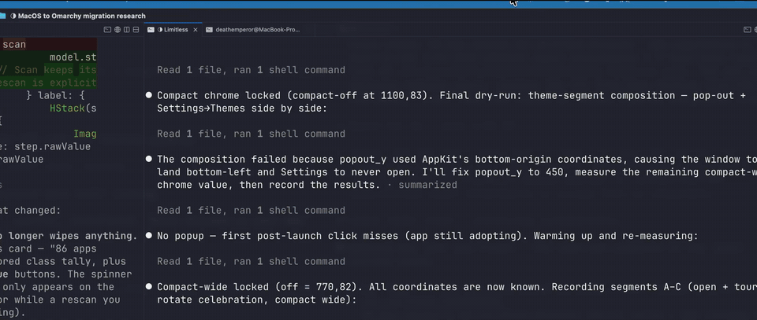
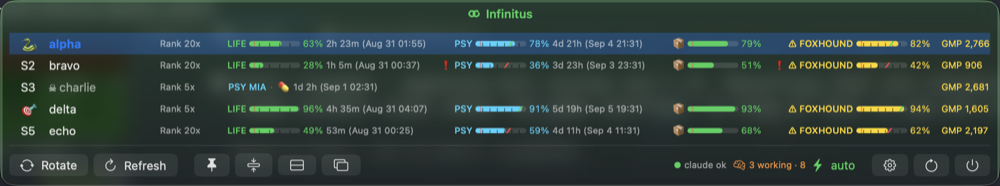
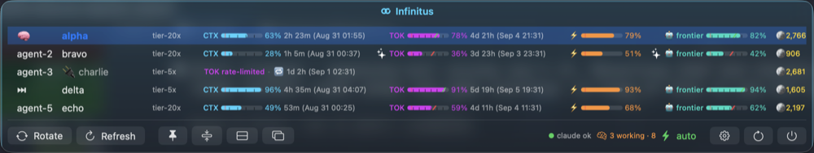
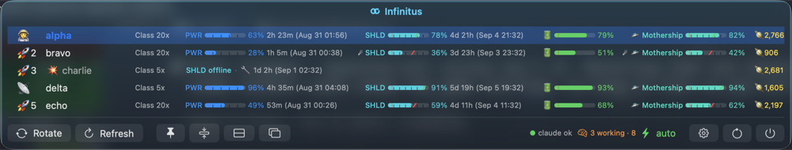
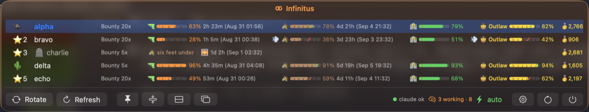
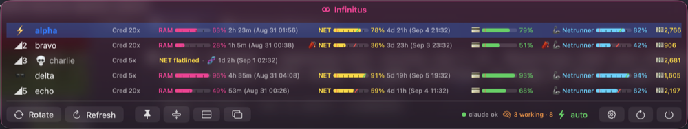
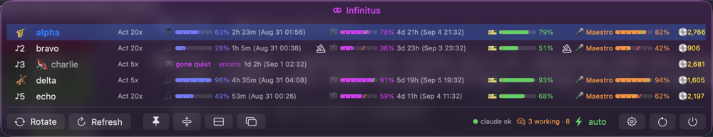
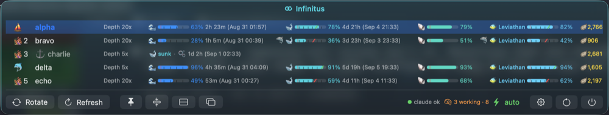

# Infinitus

**Every Claude account in one menu bar — swap before you stall.**

May your limits never bind.

[](https://github.com/deathemperor/infinitus/releases)

[](LICENSE)



A macOS menu bar app (Swift/SwiftUI) over the
[swapd](https://github.com/deathemperor/swapd) engine: live
usage gauges for a whole fleet of Claude accounts, auto-switch awareness,
and a one-click rotate — wrapped in themes from RPG to Wild West.

## Why

Claude usage windows run out at the worst moment. If you keep more than
one account, the juggling — which one has 5-hour headroom, which weekly
window is about to bind, which one just died — is exactly the kind of
state a menu bar should carry for you. Infinitus shows the whole fleet at
a glance and swaps before you stall.

## Install

Infinitus is alpha software (0.5.0-alpha.1): it runs its author's fleet
all day, but expect rough edges — please file issues.

### GitHub releases

Grab `Infinitus-<version>-arm64.dmg` from
[releases](https://github.com/deathemperor/infinitus/releases) and drop
`Infinitus.app` into `/Applications`: the desktop app, with the menu bar
app nested inside as a login item — one download for both. (The
standalone menu bar zip and its Homebrew cask left with #1238; the tap
stays as it was.)

Releases are Developer ID signed and notarized since 0.4.3, and nightly
builds are too since #1042 (they come out of the release workflow's own
jobs), so both open like any other app.

The `infinitusctl` CLI ships inside the nested bundle at
`Infinitus.app/Contents/Library/LoginItems/Infinitus Menu Bar.app/Contents/MacOS/infinitusctl`,
with `ictl` beside it as the short name for the same binary — symlink
them onto your PATH yourself
(`ln -sf "/Applications/Infinitus.app/Contents/Library/LoginItems/Infinitus Menu Bar.app/Contents/MacOS/"{infinitusctl,ictl} /usr/local/bin/`).

### Linux — engine CLI + Waybar module (Omarchy-ready)

The menu bar app is AppKit, but its Swift core ports:
`infinitus-tray` renders the same fleet — themes, sentinel notes,
one-click rotate — as a Waybar module or Quickshell plugin for
[Omarchy](https://omarchy.org) and any Waybar desktop
(see [`packaging/omarchy/`](packaging/omarchy/README.md)).
The engine is the same `swapd` the Mac app drives (`swapd add`,
`swapd auto`, `swapd list --json`):

```sh
cargo install --git https://github.com/deathemperor/swapd swapd
```

Arch users get the prebuilt tray from
[`packaging/aur/infinitus-tray-bin`](packaging/aur/); every release also
ships static `infinitus-tray-linux-x86_64` / `-aarch64` binaries and
`infinitus-omarchy.tar.gz`.

> **Container-tested only.** The PKGBUILD (`archlinux` image,
> `makepkg -s`) and the static `infinitus-tray` binary (Arch Linux ARM image, themed Waybar JSON
> against a demo fleet) all run in containers — no real accounts or
> desktop session were involved. Reports from actual Linux desktops
> welcome.

### Requirements

- macOS 14+ (best on macOS 26 — the glass chrome uses it)
- the `swapd` CLI on PATH
  (`cargo install --git https://github.com/deathemperor/swapd swapd`) —
  the app's first-run card shows the line and adds your first account

Setting it up with a coding agent? Hand it
[docs/guides/agent-setup.md](docs/guides/agent-setup.md) — install,
engine, accounts, auto-switch knobs, menu bar, verification — and
[docs/guides/infinitusctl-agent.md](docs/guides/infinitusctl-agent.md)
to drive the running app.

## Features

One line per feature; the site and the CHANGELOG carry the detail.

- **Menu bar usage** — the active account with its 5h and weekly percentages (used or remaining), the next reset, or glyph-only.
- **One account, one card** — a single account gets big gauges and full reset text; two or more get the grid.
- **Every account at a glance** — live 5-hour, weekly and per-model gauges, pace markers, reset countdowns, dead rows with the cause.
- **Auto-switch aware** — the next-candidate pick, a themed marker on the active account, switch history, a sweep on every switch.
- **Themes** — RPG, Movie, Hades, Metal Gear, Sci-Fi, Cyberpunk, Ocean and more, picked in the desktop app's Settings › Infinitus › Themes, your own via `themes.json`; the phone follows.
- **Themed menu bar** — the loop in the theme's color with its icon, a glow on switch, death and revival, an ember breath while burning ahead of pace.
- **Glass popup** — real backdrop blur in every focus state with a transparency dial, and a launch intro.
- **Right-click menu** on the bar icon — open the desktop app, rotate, refresh, capture, pin, pop out, settings, restart, quit.
- **Status chips** — engine status, auto-mode.
- **Revival probes** — when a countdown ends the Mac asks the engine again at once, and "<account> is back" says so, flagged when Anthropic reset early.
- **Cost estimates** — 7-day per-account API-list-price estimates, never billing truth.
- **iCloud settings sync** and file export/import, never credentials.
- **Push notifications** — switch and limit events in Notification Center and on the phone.
- **Pop-out window, compact mode, three layouts, popup scaling** — the pop-out remembers its spot.
- **Phone companion, four ways in** — Wi-Fi (Bonjour), Tailscale, your own Cloudflare tunnel or a free quick tunnel; one QR carries every route; pair more than one Mac.
- **Versions on the phone** — Settings shows both apps' versions and says when a newer phone build is out.
- **Widgets in your theme** — home and lock-screen widgets show the active account's windows, what's waiting, and the revival countdown; "Fleet on a Mac" shows a paired Mac of your choice and its tap opens that Mac's sessions.
- **AWS and gcloud sign-in from the desktop app or the phone** — start `aws login` or `gcloud auth login` from the Accounts page or the phone (passkeys for AWS, a paste-back code for gcloud).
- **Three engines** — swapd, CLIProxyAPI and 9Router as stacked fleets; policy stays in each engine, the app sets its knobs. swapd is multi-provider: one fleet per provider it holds (Claude, Gemini CLI…), and igniting an account refreshes it at once.
- **Priority mode** — `hold` or `interrupt` gives every fleet a headroom verdict (abundant / low / critical, with hysteresis on the active account's fullest window), so a client can pause background work before a window binds.
- **Preferences over the socket** — `infinitusctl prefs` lists every setting with its type, choices, range and effect; `prefs set` changes one live, from the CLI, the phone or the desktop app.
- **Devices** — every phone that has paired, with its route, when it was last seen and what it holds on this Mac, each with Forget.
- **Desktop app hosting** — the Infinitus desktop app drives the Mac over the control socket (`quit`, `signin-*`, `events --after`, `lock`), and its server rides the companion's quick or named Cloudflare tunnel (`fork_tunnel_*`).
- **"At this pace"** — measured burn per window, when each runs out, a per-account forecast and a plain-words plan for the next reset.
- **Stats**, on the desktop app's Stats page — commits, lines, PRs, messages, sessions, tool calls, waiting time, switches, cost; effort per activity, model, engine and effort setting; tokens/min records; cached vs uncached input and cache savings.
- **This Mac's name** — Settings › Devices names the Mac for the phone, widgets and crash reports; the default drops macOS's "(7)" suffix.
- **Dictate in any language** — Vietnamese in, an editable English draft out, with the session's own terms taught to the recognizer.
- **All accounts limited, handled** — the popup, the desktop app and the phone count down to the first account back.
- **Reset and swap alarms on the phone** — local notifications ten minutes before an exhausted account's reset and when a swap is near.
- **Crash reports, on-device** — both apps record their own crashes.
- **Randomize names** — `infinitusctl randomize-names` gives every account a fresh name from the theme's pool, or one account by number.
- **Star & pause anywhere** — right-click a name in the popup, or swipe / long-press on the phone, to star an account or pause its rotation; a paused row shows a play button to resume.
- **Ignite says what it did** — the plan line reports the window it started or why it failed, and the desktop app's Activity page keeps the log across relaunches.
- **`infinitusctl`** — an agent-facing control CLI: status, fleets, switch, hold, rename, proxy, AWS and gcloud logins, stats, perf, and Infinitus desktop's projects and threads (`threads`, `thread show|send|new|interrupt|release`, `desktop status`); plus an agent-setup guide.

## Privacy

Everything stays on your machine (the phone talks straight to your Mac
over routes you enable; the only thing that ever touches infinitus.run
is a quick tunnel's URL, keyed by a hash of the pairing token — never
the token, never usage). The app talks to the engine through
`swapd … --json` subprocesses and never reads its files (sessions and
transcripts read Claude Code's own records, nothing of the engine's);
usage-cost
figures are estimates, never billing truth; push-notification secrets
travel over stdin and render masked.

## Build from source

```sh
./make-app.sh && open Infinitus.app
```

`swift test` runs the InfinitusCore unit tests. `dev.sh` is a rebuild-on-save
loop (needs `entr`). `run-unbundled.sh` runs the executable outside the
bundle — a workaround for a login session whose menu bar stops adopting
new bundled apps (see the script header).

## Architecture rule

Everything is Swift; the engine stays fully isolated behind
`swapd … --json` subprocesses. The app never reads engine internals from
disk.

## Themes

Every theme reskins the whole row: gauge labels, the model name, the
active / next / dead markers, the reset countdown wording and the
tokens/minute chip.

| Theme | "Fable" becomes | active · next · dead | ready / resetting | tokens/min |
|---|---|---|---|---|
| Off — plain numbers | Fable | — | — | — |
| RPG — HP/MP gauges + gold | Dragon | 👑 🎲 💀 | full HP / respawning… | 🔮 mana/min |
| Movie — reels & box office | Epic | 🌟 🍿 🔚 | now showing / premiering… | 🎞 reels/min |
| Hades — blades & darkness | Hydra | 🌿 🕯 ☠ | unscathed / raising the dead… | 💀 souls/min |
| Metal Gear — tactical espionage | FOXHOUND | 🐍 🎯 ☠ | all clear / extraction inbound… | 📻 codec/min |
| AI Agentic — tokens & context | frontier | 🧠 ⏭ 🔌 | ready to ship / rate limit lifting… | 🧮 tok/min |
| Classic SWE — hand-written, no AI | mainframe | ⌨️ ⏭ 🐛 | compiles clean / recompiling… | 💻 LOC/min |
| Sci-Fi — warp cores & shields | Mothership | 🧑‍🚀 📡 💥 | all systems go / recharging… | 🛸 warp/min |
| Wild West — six-guns & gold rush | Outlaw | 🏇 🌵 🪦 | saddled up / sun's rising… | 🐎 stampede |
| Cyberpunk — chrome & neon | Netrunner | ⚡ 🕶 💀 | jacked in / rebooting… | 📶 baud |
| Gothic — candles & cathedrals | Vampire Lord | 🕯 🌹 ⚰️ | immortal / tolling midnight… | 🦇 whispers |
| Musical — tempo & encores | Maestro | 🎷 🎻 🔇 | in tune / tuning up… | 🎵 notes/min |
| Planet Earth — wild documentary | Blue Whale | 🦁 🦋 🦴 | thriving / migrating… | 🐝 buzz/min |
| Cosmos — stars & black holes | Galaxy | 🪐 🔭 🕳 | shining / orbiting back… | 🌠 flux/min |
| Ocean — tides & deep water | Leviathan | ⛵ 🐬 ⚓ | smooth sailing / tide turning… | 🌊 knots |

### Gallery

The same five-account demo fleet under every theme (pop-out window,
wide layout; charlie is out of their weekly window).

**Off — plain numbers**


**RPG — HP/MP gauges + gold**


**Movie — reels & box office**


**Hades — blades & darkness**


**Metal Gear — tactical espionage**



**AI Agentic — tokens & context**



**Classic SWE — hand-written, no AI**


**Sci-Fi — warp cores & shields**



**Wild West — six-guns & gold rush**



**Cyberpunk — chrome & neon**



**Gothic — candles & cathedrals**


**Musical — tempo & encores**



**Planet Earth — wild documentary**


**Cosmos — stars & black holes**


**Ocean — tides & deep water**



Built-in row themes live in `Sources/InfinitusCore/RowTheme.swift`; add your
own in `~/Library/Application Support/Infinitus/themes.json`, or share one
through [`themes/`](themes/README.md) with a pull request.

## Credits

Inspired by [CodexBar](https://github.com/steipete/CodexBar) (MIT) —
the menu-bar-native take on AI usage limits, and the shape of this
README.

## License

MIT — by [deathemperor](https://github.com/deathemperor) · [huuloc.com](https://huuloc.com)
